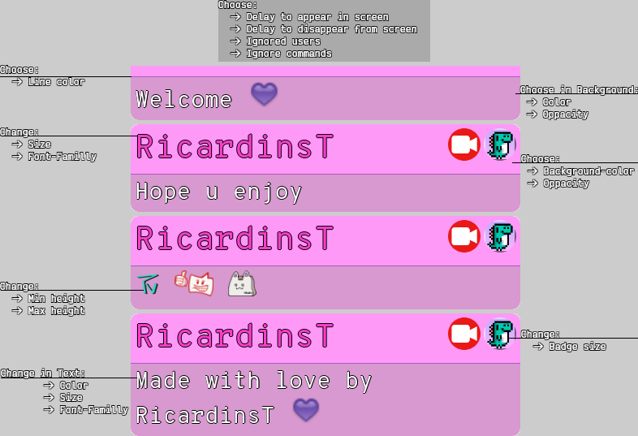

# A chat widget for your live.
 
Read this in other languages: [Português](./Readme.pt.md)

This is a custom template that I made 4 fun and decided to make it public for everyone that wishes to use!
It was created inside the streamelements overlay using a custom widget

> Open the picture for a better resolution!

  

> Also included:
+ Choose:
     + Users who will be ignored
     + Ignore messages starting with !
     + Message's delay to appear
     + Message's delay to disappear
+ Animated gifs
+ Messages deleted in the chat are also excluded from the overlay

## How to add in my overlay

1. Generate a new overlay in the streamelements dashboard. I recommend 480x720, but you can do whatever you want
2. Add a Custom Widget, you can find it in Static/Custom -> Custom Widget
3. Click in the Custom Widget that you have just created and click in "Position, size and style"
    1. Put the Width and the Height to the size you chose in the overlay
    2. Put Top and Left to 0   
4. Click in the Custom Widget that you have just created and click in open editor on the left side
    1. Copy everything of [index.html](./index.html) inside the HTML tab
    2. Copy everything of [style.css](./style.css) inside the CSS tab
    3. Copy everything of [script.js](./script.js) inside the JS tab
    4. Copy everything of [fields.json](./fields.json) inside the FIELDS tab
    5. Copy everything of [data.json](./data.json) inside the DATA tab
    6. Click in Done
5.  Select the widget and go to Settings > Fields to make your modifications!

That's all, I hope you enjoy and leave a feedback :)

## Important
Make sure to run `!emotes update` always you put a new emote to show correctly in the overlay

**PS**: It is necessary that the command is activated in your panel.

## Appreciations

To [Anymoraesz](https://www.twitch.tv/anymoraesz) for helping this project with her knowledge and design tips!