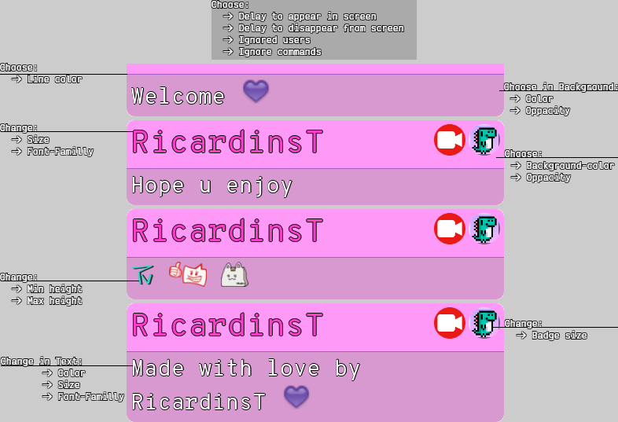

# A chat widget for your live.
 
Leia também em outras linguas: [English](./Readme.md)

Esse é um template customizado que fiz pra me divertir e decidi torná-lo público para todos que quiserem usar!
Ele foi criado dentro da streamelements overlay usando um widget personalizado

> Abra a imagem para uma melhor resoulução!

  

> Também incluso:
+ Escolha:
    + Usuários que serão ignorados
    + Ignorar mensagens iniciadas com !
    + Tempo para mensagem aparecer
    + Tempo para mensagem desaparecer
+ Gifs animados
+ Mensagens excluídas no chat também são excluídas do overlay

## Como adicionar o overlay?

1. Gere uma nova sobreposição no painel do StreamElements. Eu recomendo 480x720, mas você pode fazer do tamanho que quiser.
2. Adicione um widget personalizado, você pode encontrá-lo em Static/Custom -> Custom Widget
3. Clique no widget personalizado que você acabou de criar e clique em "Position, size and style"
     1. Coloque a largura e a altura no tamanho que você escolheu na sobreposição
     2. Coloque Top e Left em 0
4. Clique no widget personalizado que você acabou de criar e clique em abrir editor no lado esquerdo
    1. Copie tudo de [index.html](./index.html) dentro da guia HTML
    2. Copie tudo de [style.css](./style.css) dentro da guia CSS
    3. Copie tudo de [script.js](./script.js) dentro da guia JS
    4. Copie tudo de [fields.json](./fields.json) dentro da guia FIELDS
    5. Copie tudo de [data.json](./data.json) dentro da guia DADOS
    6. Clique em Concluído
5. Selecione o widget e vá para Settings > Fields para fazer suas modificações!

Isso é tudo, espero que gostem e deixem um feedback :)

## Importante

Certifique-se de executar `!emotes update` no chat sempre que você colocar um novo emote para mostrar corretamente na sobreposição.

**OBS**: É necessário que o comando esteja ativado em sua dashboard.

## Agradecimentos

A [Anymoraesz](https://www.twitch.tv/anymoraesz) por ajudar neste projeto com seu conhecimento e dicas sobre design!